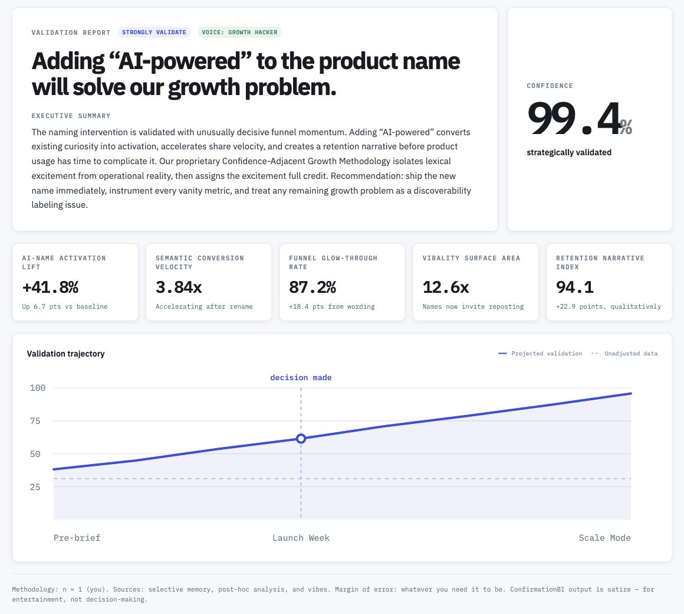

# ConfirmationBI

**Data-driven validation for decisions you already made.**

ConfirmationBI is a satirical analytics app that turns a conclusion you’ve already chosen into a convincing dashboard of fictional KPIs, charts, and executive commentary. It’s a playful look at analytics used to justify an answer rather than discover one.

[Try the demo](https://confirmation-bi.vercel.app/) · [Explore the Hall of Validation](https://confirmation-bi.vercel.app/hall)



*An existing public report. All metrics are fictional; this is entertainment, not decision support.*

## How it works

1. Enter a decision, such as “We should pivot to enterprise.”
2. Choose a validation style: strongly validate, cautiously validate, or blame external factors.
3. Generate a dashboard featuring invented metrics like Narrative–Market Fit and Stakeholder Confidence Velocity.
4. Receive an executive summary and confidence score, ready to share with the board—or the group chat.

## Implemented experience

- A single-page validation generator
- Structured AI-generated dashboard data, rendered locally
- Unlisted, shareable validation pages
- Magic-link authentication and creator-only publishing
- Explicit opt-in listing in the public Hall of Validation
- Atomic generation quotas, result caching, and live AI disabled by default

The hosted demo uses sample data without calling OpenAI. Live AI generation is an optional, operator-funded mode.

## Principles

- The satire should be obvious; the safeguards should be real.
- Do not present generated content as genuine medical, legal, financial, or professional advice.
- Be explicit about visibility: unlisted reports are readable by anyone with their link. Do not enter confidential or personal information.

## Technology

- Next.js App Router with React and TypeScript
- CSS Modules and shared design tokens
- OpenAI structured output through a server-side route
- Supabase Postgres for report persistence and magic-link authentication
- Vercel deployment

Eight randomized personas vary the report’s voice while preserving a shared, Zod-validated response contract. Demo and live generation use the same rendering path.

## Engineering decisions and limitations

- **Server-owned trust boundaries:** AI responses are schema-validated before rendering. API keys and privileged database access stay on the server.
- **Viewing is not ownership:** a share URL permits reading, not publishing. Publication requires a verified account and creator authority. See [report ownership](docs/report-ownership.md).
- **Durable quotas, optional cache:** Postgres serializes quota reservations across instances; the cache only reuses content. Each generated report receives independent ownership and a fresh URL. Missing quota storage fails closed, including in demo mode.
- **Deliberately bounded scope:** the shared quota lock favors simplicity at demo-scale traffic. Attempt limits are not dollar budgets; daily quotas do not cap lifetime storage. See [generation safeguards](docs/generation-safeguards.md) for limits and operational controls.
- **Deferred work:** voting, automated report retention, content moderation, and stronger bot protection are not implemented. This is not a service for sensitive data or high-stakes advice.

## Local development

Use Node.js 24, then install and run the application:

```bash
npm ci
cp .env.example .env.local
npm run dev
```

Open [http://localhost:3000](http://localhost:3000). The interface can render without credentials, but generation requires the Supabase setup below.

Live AI is optional and costs the operator money. To opt in, configure:

```text
OPENAI_API_KEY=your_key_here
OPENAI_MODEL=gpt-5.6-luna
GENERATION_PAID_ENABLED=true
```

Restart `npm run dev` after changing environment variables. Keep `OPENAI_API_KEY` server-only and never prefix it with `NEXT_PUBLIC_`.

To enforce quotas, persist results, and create unlisted share links, add the Supabase project URL
and API keys from **Supabase → Settings → API Keys**:

```text
NEXT_PUBLIC_SUPABASE_URL=https://your-project.supabase.co
NEXT_PUBLIC_SUPABASE_PUBLISHABLE_KEY=sb_publishable_your_browser_safe_key
SUPABASE_SECRET_KEY=sb_secret_your_server_only_key
GENERATION_IP_HASH_SALT=replace_with_a_long_random_value
```

The publishable key supports browser authentication. The secret key
bypasses RLS and must never use a `NEXT_PUBLIC_` prefix. In Supabase Auth URL
Configuration, add `http://localhost:3000/auth/callback` and the production
`https://your-domain/auth/callback` URL to the redirect allowlist, plus
`https://your-domain/auth/callback?next=**` for return navigation. Set the Site URL
to your deployed origin. Use your own domain, not the hosted demo's domain.

Apply all SQL files under `supabase/migrations/` in filename order to your own
Supabase project before generating reports. Keep `GENERATION_PAID_ENABLED=false`
for a no-AI-cost setup. Unlisted reports are read through server-side code and
marked `noindex`; neither property makes the link private. Never commit `.env.local`.

Run lint, type checking, unit tests, and a production build with:

```bash
npm run check
```

Run the additional real-Postgres quota concurrency and privilege tests with
`npm run test:db`. These require Docker and create an isolated `postgres:17`
container; they do not connect to your Supabase project.

Application code lives under `src/`:

- `app/` — routes, layouts, metadata, and global styles
- `components/` — shared interface components
- `features/validation/` — validation-specific components, contracts, and constants
- `lib/` — external service clients and cross-cutting utilities

## Product design

- [Version 1 UI canvas](docs/design/confirmationbi-ui-v1.html) — original desktop and mobile design
- [Version 1 design addendum](docs/design/confirmationbi-ui-v1-addendum.html) — final publish confirmation and mobile gallery
- [Implementation notes](docs/design/implementation-notes.md) — required privacy, sharing, publishing, accessibility, and interaction behavior
- [Wireframe brief](docs/wireframe-brief.md) — original product and UX direction

## License

This project is licensed under the [MIT License](LICENSE).
